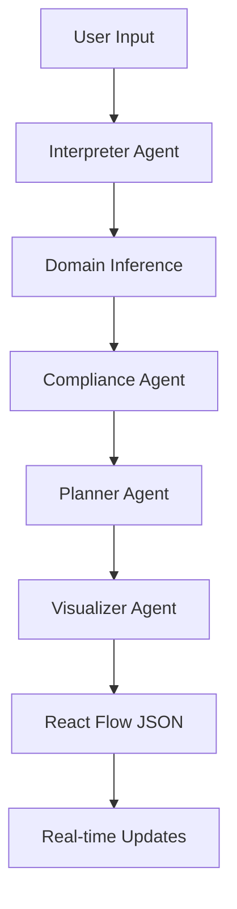

# SecureAI Mediator Agent

Production-ready Mediator agent with voice integration, React Flow diagram management, and automated compliance enforcement.

## 🚀 Features

- **Voice Integration**: ElevenLabs-powered speech-to-text and text-to-speech
- **Real-time Flow Diagrams**: React Flow integration with WebSocket updates
- **Domain Inference**: Automatic detection of healthcare, finance, government, and other domains
- **Compliance Enforcement**: Auto-injection of domain-specific compliance nodes (HIPAA, PCI-DSS, FISMA, etc.)
- **CrewAI Integration**: Multi-agent orchestration for workflow processing
- **WebSocket Support**: Real-time updates for collaborative editing
- **Structured Logging**: Comprehensive monitoring and error tracking

## 📋 Requirements

- Python 3.8+
- OpenAI API key
- ElevenLabs API key

## 🛠️ Installation

1. **Clone the repository**:
```bash
git clone <repository-url>
cd SecureAI
```

2. **Install dependencies**:
```bash
pip install -r requirements.txt
```

3. **Configure environment variables**:
```bash
cp .env.example .env
# Edit .env with your API keys
```

Required environment variables:
```env
OPENAI_API_KEY=your_openai_api_key_here
ELEVENLABS_API_KEY=your_elevenlabs_api_key_here
```

Optional environment variables:
```env
HOST=0.0.0.0
PORT=8000
LOG_LEVEL=INFO
RELOAD=true
```

## 🚀 Quick Start

**Start the Mediator API server**:
```bash
python run_mediator.py
```

The server will start on `http://localhost:8000` with:
- REST API endpoints at `/api/*`
- WebSocket connections at `/ws/{session_id}`
- API documentation at `/docs`

## 📡 API Usage

### 1. Create a Session

```bash
curl -X POST "http://localhost:8000/api/sessions" \
  -H "Content-Type: application/json" \
  -d '{
    "user_id": "user123",
    "user_input": "I need to process patient medical records and send them to doctors",
    "title": "Healthcare Workflow"
  }'
```

Response:
```json
{
  "success": true,
  "session_id": "uuid-session-id",
  "workflow_state": {
    "domain": "healthcare",
    "flow_graph": {
      "nodes": [...],
      "edges": [...]
    }
  }
}
```

### 2. Process Text Input

```bash
curl -X POST "http://localhost:8000/api/process-input" \
  -H "Content-Type: application/json" \
  -d '{
    "user_input": "Add email notification step",
    "session_id": "uuid-session-id"
  }'
```

### 3. Process Voice Input

```bash
curl -X POST "http://localhost:8000/api/process-voice" \
  -F "audio_file=@audio.wav" \
  -F "user_id=user123" \
  -F "session_id=uuid-session-id"
```

### 4. Update Flow Diagram

```bash
curl -X POST "http://localhost:8000/api/flow-update" \
  -H "Content-Type: application/json" \
  -d '{
    "session_id": "uuid-session-id",
    "delta": {
      "type": "node_added",
      "data": {
        "label": "New Process Step",
        "type": "process",
        "x": 300,
        "y": 200
      }
    }
  }'
```

### 5. WebSocket Real-time Updates

```javascript
const ws = new WebSocket('ws://localhost:8000/ws/session-id');

ws.onmessage = function(event) {
  const data = JSON.parse(event.data);
  if (data.type === 'flow_update') {
    // Update your React Flow diagram
    updateFlowDiagram(data.data.flow);
  }
};

// Send flow changes
ws.send(JSON.stringify({
  type: 'flow_delta',
  data: {
    type: 'node_moved',
    node_id: 'node-123',
    updates: { x: 400, y: 300 }
  }
}));
```

## 🏗️ Architecture

### Core Components

1. **Enhanced Mediator Crew** (`enhanced_crew.py`)
   - Orchestrates multiple AI agents
   - Handles voice and text processing
   - Manages workflow creation and updates

2. **Flow Manager** (`flow_manager.py`)
   - Manages React Flow diagrams
   - Handles real-time updates
   - Enforces compliance rules

3. **Domain Inference Engine** (`domain_inference.py`)
   - Detects domain from user input
   - Auto-injects compliance requirements
   - Validates workflow compliance

4. **Voice Handler** (`voice_handler.py`)
   - ElevenLabs integration
   - Speech-to-text processing
   - Text-to-speech generation

5. **API Server** (`api.py`)
   - FastAPI REST endpoints
   - WebSocket real-time updates
   - Request/response handling

### Agent Workflow



## 🔒 Compliance Domains

The system automatically detects and enforces compliance for:

### Healthcare (HIPAA)
- **Triggers**: "patient", "medical", "health", "PHI", "HIPAA"
- **Required Nodes**: PHI Redaction, HIPAA Audit Log, Encryption
- **Restrictions**: Cannot remove compliance nodes

### Finance (PCI-DSS)
- **Triggers**: "payment", "financial", "PCI-DSS", "transaction"
- **Required Nodes**: PCI-DSS Validation, Fraud Detection, Transaction Audit
- **Restrictions**: Mandatory fraud detection and audit trails

### Government (FISMA)
- **Triggers**: "government", "federal", "FISMA", "NIST"
- **Required Nodes**: NIST Controls, FISMA Compliance, Government Audit
- **Restrictions**: NIST controls cannot be bypassed

### Education (FERPA)
- **Triggers**: "student", "educational", "FERPA", "academic"
- **Required Nodes**: FERPA Protection, Educational Audit
- **Restrictions**: Student record protection mandatory

## 🎯 Usage Examples

### Example 1: Healthcare Workflow

```python
import requests

# Create healthcare workflow
response = requests.post("http://localhost:8000/api/sessions", json={
    "user_id": "doctor123",
    "user_input": "I need to process patient lab results and send them to the attending physician",
    "title": "Lab Results Processing"
})

session_id = response.json()["session_id"]
# Automatically creates workflow with HIPAA compliance nodes
```

### Example 2: Financial Transaction Processing

```python
# Create financial workflow
response = requests.post("http://localhost:8000/api/sessions", json={
    "user_id": "bank_user",
    "user_input": "Process credit card payments and detect fraud",
    "title": "Payment Processing"
})
# Automatically includes PCI-DSS validation and fraud detection
```

### Example 3: Voice-Driven Workflow Creation

```python
# Upload voice file
with open("voice_command.wav", "rb") as f:
    response = requests.post(
        "http://localhost:8000/api/process-voice",
        files={"audio_file": f},
        data={"user_id": "user123"}
    )

# Voice is transcribed and processed into workflow
workflow = response.json()["flow"]
```

## 🔧 Configuration

### Logging Configuration

Configure logging in `agentcrews/mediator/logging_config.py`:

```python
# Set log level
structured_logger = StructuredLogger(
    log_level="DEBUG",  # DEBUG, INFO, WARNING, ERROR
    log_file="custom_mediator.log"
)
```

### Voice Settings

Customize ElevenLabs voice settings:

```python
voice_handler = VoiceHandler()
voice_handler.voice_settings = VoiceSettings(
    stability=0.8,
    similarity_boost=0.6,
    style=0.2
)
```

### Domain Customization

Add custom domain detection:

```python
# In domain_inference.py
self.domain_keywords[DomainType.CUSTOM] = {
    'keywords': ['custom', 'specific', 'terms'],
    'patterns': [r'\bcustom\s+pattern\b']
}
```

## 📊 Monitoring

### Structured Logging

All events are logged with structured data:

```json
{
  "timestamp": "2024-01-15T10:30:00Z",
  "level": "INFO",
  "event_type": "voice_interaction",
  "user_id": "user123",
  "session_id": "session456",
  "interaction_type": "user_input",
  "content_length": 145
}
```

### Performance Metrics

Monitor key metrics:
- Agent execution times
- API response times
- Voice processing latency
- Compliance validation duration

### Health Check

```bash
curl http://localhost:8000/health
```

## 🚨 Error Handling

The system provides comprehensive error handling:

- **Voice Processing Errors**: Graceful fallback to text input
- **Compliance Violations**: Automatic correction with user notification
- **Agent Failures**: Retry logic with exponential backoff
- **WebSocket Disconnections**: Automatic reconnection

## 🧪 Testing

Run the system with test data:

```bash
# Test healthcare workflow
curl -X POST "http://localhost:8000/api/process-input" \
  -H "Content-Type: application/json" \
  -d '{
    "user_input": "Process patient medical records with HIPAA compliance",
    "user_id": "test_user"
  }'
```

## 🤝 Contributing

1. Fork the repository
2. Create a feature branch
3. Make your changes
4. Add tests
5. Submit a pull request

## 📄 License

This project is licensed under the MIT License.

## 🆘 Support

For support and questions:
- Check the API documentation at `/docs`
- Review logs in `mediator.log` and `mediator_structured.log`
- Monitor WebSocket connections for real-time debugging

## 🔮 Roadmap

- [ ] Integration with n8n workflow execution
- [ ] Advanced compliance templates
- [ ] Multi-language voice support
- [ ] Workflow versioning and rollback
- [ ] Advanced analytics dashboard
- [ ] Enterprise SSO integration
